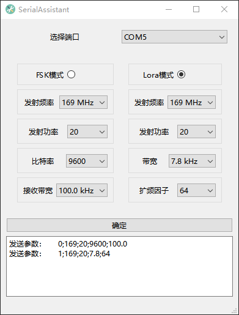

# 科研课堂串口助手

## 功能
- 切换 Lora / FSK 模式
- 更改频率
- 更改发射功率
- 更改比特率
- 更改带宽
- 更改扩频因子
## 使用方法
1. 选择模式
2. 更改参数
3. 点击确定

即可通过串口发送一串参数字符串，随后由单片机解析字符串并进行实际参数的设定。

## 参数字符串示例
### `0;169;20;9600;100.0` 

FSK模式；发射频率 169 MHz；发射功率 20；比特率 9600；接收带宽100.0 kHz

### `1;169;20;7.8;64`

Lora模式；发射频率 169 MHz；发射功率 20；带宽 7.8 kHz；扩频因子 64

